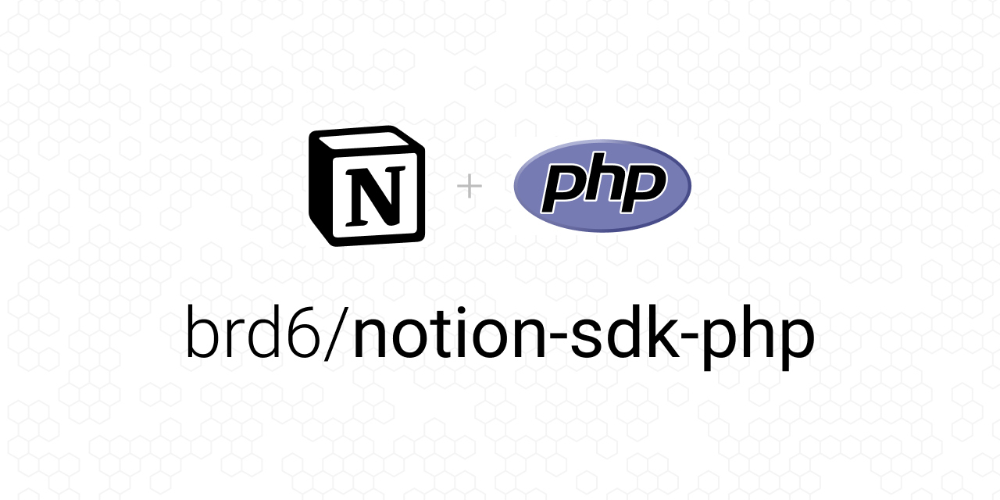

<p align="center">
    <strong>Notion SDK for PHP</strong>
</p>

<p align="center">
    <a href="https://github.com/brd6/notion-sdk-php"></a>
    <a href="https://packagist.org/packages/brd6/notion-sdk-php"></a>
    <a href="https://php.net"></a>
    <a href="https://github.com/brd6/notion-sdk-php/blob/main/LICENSE"></a>
    <a href="https://github.com/brd6/notion-sdk-php/actions/workflows/continuous-integration.yml"></a>
</p>

PHP version of the official [NOTION API](https://developers.notion.com). It works the same way as the reference [JavaScript SDK](https://github.com/makenotion/notion-sdk-js) 🎉


## Installation

Install this package as a dependency using [Composer](https://getcomposer.org).

``` bash
composer require brd6/notion-sdk-php
```

This package `(brd6/notion-sdk-php)` is not tied to any specific library such as Guzzle or Buzz that sends HTTP messages. Instead, it uses the [PSR-18](https://www.php-fig.org/psr/psr-18/) client abstraction to let users choose whichever [PSR-7 implementation](https://packagist.org/providers/psr/http-message-implementation)
and [HTTP client](https://packagist.org/providers/psr/http-client-implementation) they want to use.

If you just want to get started quickly with symfony http client, run the following command:

```bash
composer require brd6/notion-sdk-php symfony/http-client nyholm/psr7
```

## Usage

> Use Notion's [Getting Started Guide](https://developers.notion.com/docs/getting-started) to get set up to use Notion's API.

Import and initialize a client using an **integration token** or an OAuth **access token**.

```php
use Brd6\NotionSdkPhp\Client;
use Brd6\NotionSdkPhp\ClientOptions;

$options = (new ClientOptions())
    ->setAuth(getenv('NOTION_TOKEN'));

$notion = new Client($options);
```

Make a request to any Notion API endpoint.

> See the complete list of endpoints in the [API reference](https://developers.notion.com/reference).
```php
$listUsersResponse = $notion->users()->list();
var_dump($listUsersResponse->toArray());
```

```php
array (size=4)
  'has_more' => boolean false
  'results' =>
    array (size=2)
      0 =>
        array (size=6)
          'object' => string 'user' (length=4)
          'id' => string '7f03dda0-a132-49d7-b8b2-29c9ed1b1f0e' (length=36)
          'type' => string 'person' (length=6)
          'name' => string 'John Doe' (length=8)
          'avatar_url' => string 'https://s3-us-west-2.amazonaws.com/public.notion-static.com/521dfe9c-f821-4de8-a0bb-e40ff71283e5/39989484_10217003981481443_4621803518267752448_n.jpg' (length=149)
          'person' =>
            array (size=1)
              ...
      1 =>
        array (size=5)
          'object' => string 'user' (length=4)
          'id' => string '8dee9e49-7369-4a6d-a11f-7db625b2448c' (length=36)
          'type' => string 'bot' (length=3)
          'name' => string 'MyBot' (length=5)
          'bot' =>
            array (size=1)
              ...
  'object' => string 'list' (length=4)
  'type' => string 'user' (length=4)
```

Endpoint parameters are grouped into a single object. You don't need to remember which parameters go in the path, query, or body.
```php
$databaseRequest = new DatabaseRequest();
$databaseRequest->setFilter([
    'property' => 'Landmark',
    'text' => [
        'contains' => 'Bridge',
    ],
]);
$myPage = $notion->databases()->query('897e5a76-ae52-4b48-9fdf-e71f5945d1af', $databaseRequest)
```

### Handling errors

If the API returns an unsuccessful response, an `ApiResponseException` will be thrown.

The error contains properties from the response, and the most helpful is `code`. You can compare `code` to the values in the `NotionErrorCodeConstant` object to avoid misspelling error codes.

### Client options

The `Client` supports the following options on initialization. These options can be set on the `ClientOptions` instance.

| Option       | Default value              | Type                              | Description                                                                                                                                        |
|--------------|----------------------------|-----------------------------------|----------------------------------------------------------------------------------------------------------------------------------------------------|
| `auth`       | `''`                       | `string`                          | Bearer token for authentication. If left undefined, the `auth` parameter should be set on each request.                                            |
| `timeout`    | `60`                       | `number`                          | Number of seconds to wait before throw a `RequestTimeoutException`                                                                                 |
| `baseUrl`    | `"https://api.notion.com"` | `string`                          | The root URL for sending API requests. This can be changed to test with a mock server.                                                             |
| `httpClient` | Default Http Client        | `Psr\Http\Client\ClientInterface` | The Http Client used to make request on the Notion API. This can be change to customize the base Http Client or replace with a mocked Http Client. |

## Contributing

Contributions are welcome! To contribute, please familiarize yourself with
[CONTRIBUTING.md](CONTRIBUTING.md).


## License

The MIT License (MIT). Please see [LICENSE](LICENSE) for more information.


